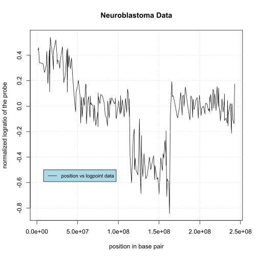
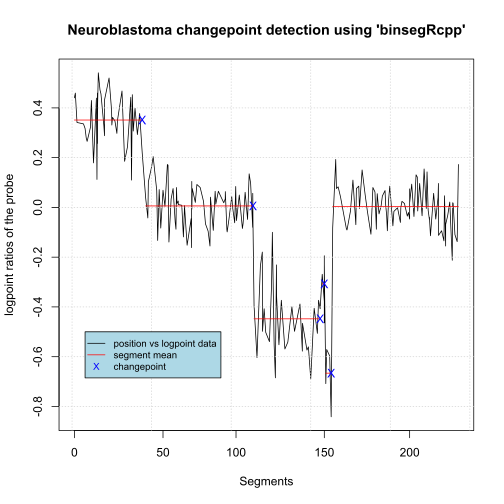
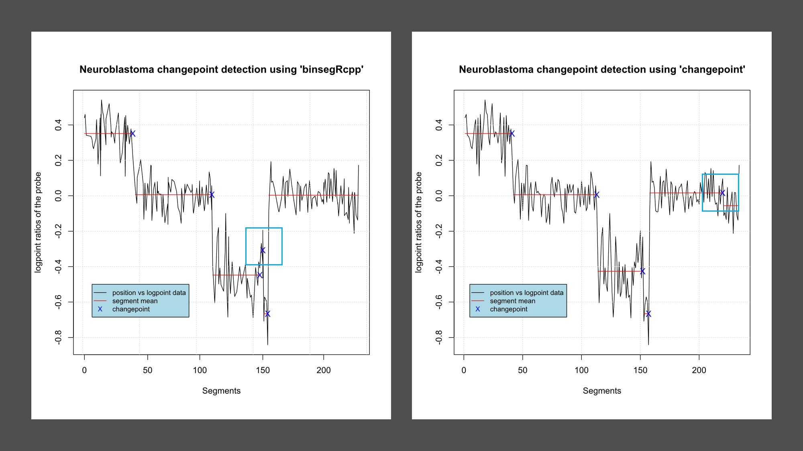

# rstats-test 
Binary Segmentation Project tests

## Easy
- Download data(*neuroblastoma*, package=”neuroblastoma”) and **plot profile.id=4**, **chromosome=2**, (**y=logratio**, ***x=position***).
    ```txt
    total data points = 234
    ```
    

- Use *binsegRcpp* to compute binary segmentation models up to 5 segments (change in mean, normal distribution), then plot those segment means and changepoints on top of the data.

    | S No. | 1 | 2 | 3 | 4 | 5 | 6 |
    | --- | --- | --- | --- | --- | --- | --- |
    | Segment | 1-41 | 42-113 | 114-146 | 147-152 | 153-157 | 158-234 |
    | Mean | 0.351231083 | 0.005885206 | -0.447813047 | -0.307411681 | -0.666259257 | 0.003035709 |
    | Changepoint | 41 | 113 | 146 | 152 | 157 | - |
    
    

    
## Medium
- Use the *changepoint* package to compute models up to 5 segments for the same data set. 

    | S No. | 1 | 2 | 3 | 4 | 5 | 6 |
    | --- | --- | --- | --- | --- | --- | --- |
    | Segment | 1-41 | 42-113 | 114-152 | 153-157 | 158-220 | 220-234 |
    | Mean | 0.351231083 | 0.005885206 | -0.426212837 | -0.666259257 | 0.016075375 | -0.055642790 
    | Changepoint | 41 | 113 | 152 | 157 | 220 | - |

- Are the changepoints the same? 

    While most of the changepoints are same there are few variation, shown in table and in figure as <i style="color:skyblue">blue box</i>. 
    <table align=center>
        <tr>
            <td>Package</td>
            <td colspan="5">Changepoints</td>
        </tr>
        <tr>
            <td>binsegRcpp</td>
            <td> 41 </td>
            <td> 113 </td>
            <td> <i style="color:red">146</i> </td>
            <td> 152 </td>
            <td> 157 </td>
        </tr>
        <tr>
            <td>changepoint</td>
            <td> 41 </td>
            <td> 113 </td>
            <td> 152 </td>
            <td> 157 </td>
            <td> <i style="color:red">220</i> </td>
        </tr>
    </table>

    


## Hard 1
- Implement Negative Binomial loss function in C code using the same arguments as in [changepoint/src/cost_general_functions.c]("https://github.com/rkillick/changepoint/blob/master/src/cost_general_functions.c").


## Hard 2
- Fork binsegRcpp and modify [src/binseg_normal.cpp]("https://github.com/tdhock/binsegRcpp/blob/master/src/binseg_normal.cpp") so that it computes change in mean and variance (instead of change of mean with constant variance).
- Use it to compute changepoints for the same neuroblastoma data set, and verify that the result is the same as the result of `changepoint::cpt.meanvar`.